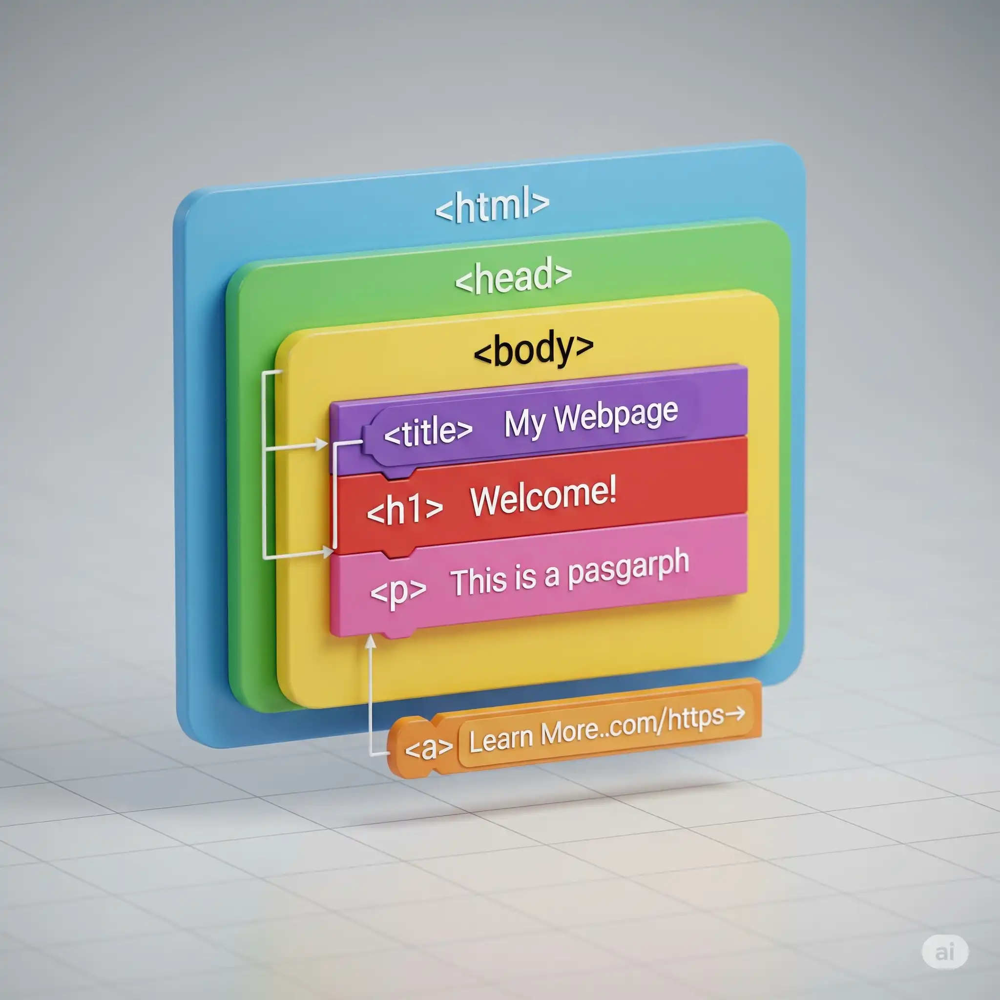
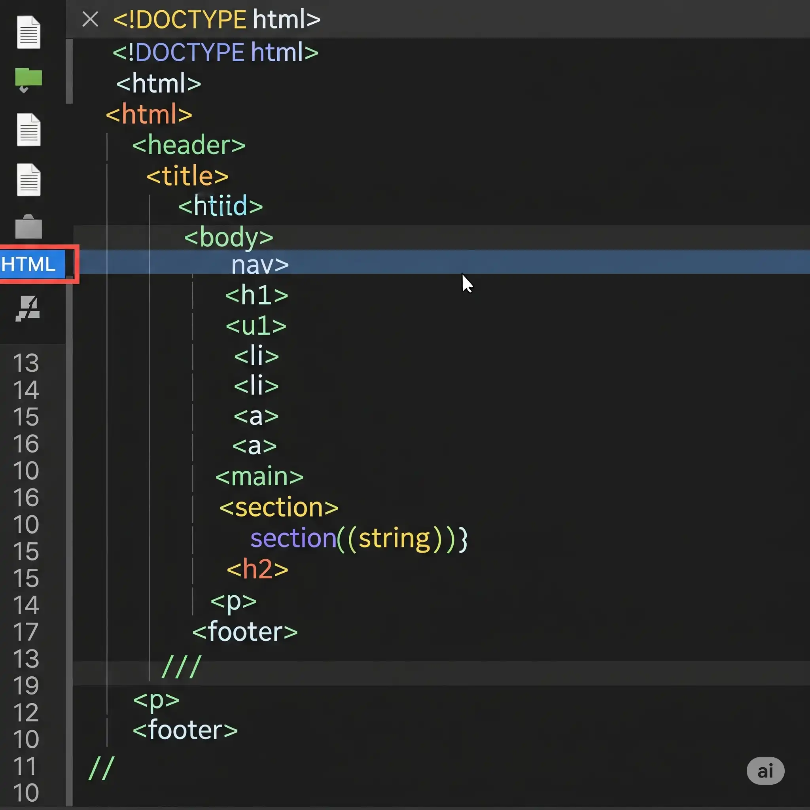

# 📱 Troisième Séance CSS : Responsive Web Design

## 📋 Informations de l'exercice

- **Type d'exercice** : Création d'une mise en page responsive
- **Durée estimée** : 5 heures
- **Niveau** : Intermédiaire
- **Prérequis** : Avoir complété les séances 1 (HTML sémantique) et 2 (CSS de base)

## 🎯 Objectif de l'exercice

Mettre en pratique les connaissances acquises sur :

- L'approche **Mobile First**
- Les **Media Queries** pour adapter l'affichage
- Les **unités CSS responsives** (rem, %, vh, vw)
- L'utilisation de **l'inspecteur d'éléments** du navigateur
- Les **images responsives** avec l'attribut `srcset`
- La gestion des **ratios d'images** avec `object-fit` et `background-size`

L'objectif est de transformer la page HTML/CSS existante en une page web **entièrement responsive**, adaptée à tous les types d'écrans (mobile, tablette, desktop).

## 🎭 Contexte

Vous êtes **Concepteur Designer UI** et votre client vous demande d'adapter son article de blog pour qu'il s'affiche correctement sur tous les appareils. Les utilisateurs consultent le blog aussi bien sur leur smartphone que sur leur ordinateur de bureau. Vous devez garantir une expérience de lecture optimale sur tous les supports.

---

## 📋 Consignes Détaillées

### 1. 🔍 Préparation et Découverte de l'Inspecteur d'Éléments

#### Vérification du viewport

- Ouvrez le fichier `index.html` et assurez-vous que la balise meta viewport est présente dans le `<head>` :
  ```html
  <meta name="viewport" content="width=device-width, initial-scale=1.0">
  ```

> 💡 **Explication** : Cette balise est **essentielle** pour le responsive design. Elle indique au navigateur d'adapter la largeur de la page à celle de l'écran de l'appareil.

#### Découverte de l'inspecteur d'éléments

- Ouvrez votre page `index.html` dans un navigateur (Chrome, Firefox ou Edge)
- Ouvrez les **outils de développement** :
  - **Windows/Linux** : `F12` ou `Ctrl + Shift + I`
  - **Mac** : `Cmd + Option + I`
- Cliquez sur l'icône **"Toggle device toolbar"** (📱) ou utilisez le raccourci `Ctrl + Shift + M` (Windows) / `Cmd + Shift + M` (Mac)

#### Exercice pratique avec l'inspecteur

1. Testez l'affichage de votre page sur différents appareils simulés :
   - iPhone SE (375px)
   - iPad Mini (768px)
   - Desktop (1024px et plus)

2. Observez comment votre page actuelle se comporte à chaque résolution.

> 📝 **Question de réflexion 1** : Notez les problèmes d'affichage que vous observez sur mobile. Quels éléments ne s'adaptent pas correctement ? (Rédigez 2-3 phrases)
>
> _Votre réponse :_ _______________________________________________

---

### 2. 📐 Comprendre les Unités CSS Responsives

Avant de modifier le CSS, découvrons les différentes unités disponibles.

#### Les unités relatives

| Unité | Description | Exemple d'utilisation |
|-------|-------------|----------------------|
| `%` | Pourcentage par rapport au parent | Largeurs de conteneurs |
| `rem` | Relatif à la taille de police de `<html>` (16px par défaut) | Tailles de police, marges |
| `em` | Relatif à la taille de police du parent | Espacements dans un composant |
| `vw` | 1% de la largeur du viewport | Titres adaptatifs |
| `vh` | 1% de la hauteur du viewport | Sections plein écran |
| `vmin` | 1% de la plus petite dimension (largeur ou hauteur) | Éléments carrés adaptatifs |
| `vmax` | 1% de la plus grande dimension | Moins courant |

> 📝 **Question de réflexion 2** : Quelle est la différence entre `em` et `rem` ? Pourquoi privilégie-t-on souvent `rem` pour les tailles de police ?
>
> _Votre réponse :_ _______________________________________________

#### Exercice : Tester les unités dans l'inspecteur

1. Dans l'inspecteur, sélectionnez l'élément `<h1>`
2. Dans le panneau "Styles", ajoutez temporairement : `font-size: 5vw;`
3. Redimensionnez la fenêtre et observez comment le titre s'adapte
4. Testez également avec `font-size: 2.5rem;` et comparez le comportement

---

### 3. 📱 Mise en Page Mobile First

L'approche **Mobile First** consiste à écrire d'abord les styles pour mobile, puis à ajouter des Media Queries pour les écrans plus grands.

#### Étape 3.1 : Conversion des unités fixes en unités responsives

Dans votre fichier `style.css`, effectuez les modifications suivantes :

**Remplacer les tailles de police en pixels par des rem :**

```css
/* AVANT */
body {
  font-family: Arial, sans-serif;
  color: #333;
}

/* APRÈS - Ajoutez une taille de base et utilisez rem */
html {
  font-size: 16px; /* Taille de base pour les calculs rem */
}

body {
  font-family: Arial, sans-serif;
  color: #333;
  font-size: 1rem; /* 16px */
  line-height: 1.6; /* Améliore la lisibilité */
}
```

> 💡 **Astuce calcul** : Pour convertir des pixels en rem, divisez par 16.
> - 24px → 24/16 = 1.5rem
> - 32px → 32/16 = 2rem
> - 14px → 14/16 = 0.875rem

#### Étape 3.2 : Styles de base pour mobile

Modifiez votre CSS pour que les styles par défaut (hors Media Queries) correspondent à l'affichage mobile :

```css
/* --- STYLES MOBILE (par défaut) --- */

/* Header en colonne sur mobile */
header {
  display: flex;
  flex-direction: column; /* Empile les éléments verticalement */
  align-items: center;
  padding: 1rem; /* 16px en rem */
  border-bottom: 1px solid #ccc;
  gap: 1rem; /* Espace entre le logo et la nav */
}

/* Logo adaptatif */
header img {
  max-width: 150px;
  width: 50%; /* S'adapte sur petits écrans */
}

/* Navigation verticale sur mobile */
nav ul {
  display: flex;
  flex-direction: column;
  align-items: center;
  padding: 0;
  margin: 0;
  gap: 0.75rem; /* 12px */
}

nav ul li {
  list-style: none;
}

/* Contenu principal */
main {
  padding: 0 1rem; /* Espacement latéral sur mobile */
  margin: 1.25rem auto; /* 20px en rem */
}

article {
  padding: 1rem;
  border: 1px solid #ddd;
}

/* Sections */
section {
  margin-bottom: 2rem; /* 32px */
}

h1 {
  font-size: 1.75rem; /* 28px - Plus petit sur mobile */
}

h2 {
  font-size: 1.35rem; /* ~22px */
  margin-bottom: 1rem;
}

/* Footer */
footer {
  background-color: #f4f4f4;
  padding: 1.25rem;
  text-align: center;
}
```

#### Étape 3.3 : Testez votre mise en page mobile

1. Utilisez l'inspecteur en mode responsive
2. Sélectionnez un appareil mobile (iPhone SE ou Galaxy S8)
3. Vérifiez que :
   - Le header s'affiche en colonne (logo au-dessus du menu)
   - Le texte est lisible sans zoom
   - Les marges ne sont pas trop grandes

> 📝 **Question de réflexion 3** : Pourquoi commence-t-on par le mobile plutôt que par le desktop dans l'approche "Mobile First" ?
>
> _Votre réponse :_ _______________________________________________

---

### 4. 📊 Media Queries pour Tablette (768px et plus)

Les **Media Queries** permettent d'appliquer des styles CSS uniquement quand certaines conditions sont remplies (largeur d'écran, orientation, etc.).

#### Syntaxe d'une Media Query

```css
@media (min-width: 768px) {
  /* Ces styles s'appliquent UNIQUEMENT si l'écran fait 768px ou plus */
}
```

#### Ajoutez la Media Query tablette

À la **fin** de votre fichier `style.css`, ajoutez :

```css
/* ═══════════════════════════════════════════════════════════════════════════ */
/* 📱➡️💻 MEDIA QUERY TABLETTE (768px et plus)                                 */
/* ═══════════════════════════════════════════════════════════════════════════ */

@media (min-width: 768px) {

  /* Header horizontal sur tablette */
  header {
    flex-direction: row; /* Aligne horizontalement */
    justify-content: space-between;
    padding: 1.25rem 2rem;
  }

  header img {
    max-width: 180px;
    width: auto;
  }

  /* Navigation horizontale */
  nav ul {
    flex-direction: row;
    gap: 1.5rem; /* 24px entre les liens */
  }

  /* Contenu principal centré */
  main {
    max-width: 720px;
    padding: 0 2rem;
  }

  article {
    padding: 1.5rem;
  }

  h1 {
    font-size: 2.25rem; /* 36px */
  }

  h2 {
    font-size: 1.5rem; /* 24px */
  }

}
```

#### Testez la Media Query

1. Dans l'inspecteur, redimensionnez la fenêtre de 320px à 800px
2. Observez le "saut" de mise en page à 768px
3. Vérifiez que le header passe bien de vertical à horizontal

---

### 5. 🖥️ Media Queries pour Desktop (1024px et plus)

#### Ajoutez la Media Query desktop

```css
/* ═══════════════════════════════════════════════════════════════════════════ */
/* 💻 MEDIA QUERY DESKTOP (1024px et plus)                                     */
/* ═══════════════════════════════════════════════════════════════════════════ */

@media (min-width: 1024px) {

  /* Contenu principal plus large */
  main {
    max-width: 960px;
  }

  article {
    padding: 2rem;
  }

  h1 {
    font-size: 2.5rem; /* 40px */
  }

  /* Mise en page avancée : texte + image côte à côte */
  .section-flex {
    display: flex;
    gap: 2rem;
    align-items: flex-start;
  }

  .section-flex .content {
    flex: 1; /* Prend l'espace restant */
  }

  .section-flex img {
    max-width: 300px;
    flex-shrink: 0; /* Ne rétrécit pas */
  }

}
```

> 📝 **Question de réflexion 4** : Que signifie `@media (min-width: 1024px)` ? Expliquez avec vos propres mots.
>
> _Votre réponse :_ _______________________________________________

#### Modification du HTML pour la mise en page desktop

Pour activer la mise en page texte/image côte à côte sur desktop, modifiez deux sections dans votre `index.html` :

**Section "Les Fondamentaux" :**

```html
<section class="section-flex">
  <div class="content">
    <h2>Les Fondamentaux du HTML</h2>
    <p>Le HTML, ou HyperText Markup Language...</p>
  </div>
  
</section>
```

**Section "Astuces et Bonnes Pratiques" :**

```html
<section class="section-flex">
  <div class="content">
    <h2>Astuces et Bonnes Pratiques</h2>
    <p>Pour un code HTML robuste...</p>
    <ol>...</ol>
  </div>
  
</section>
```

---

### 6. 🖼️ Images Responsives avec srcset

L'attribut `srcset` permet au navigateur de choisir automatiquement l'image la plus adaptée selon la taille de l'écran et la densité de pixels.

#### Pourquoi utiliser srcset ?

- **Performance** : Le navigateur télécharge une image adaptée (pas une image 4K sur mobile !)
- **Qualité** : Affichage net sur les écrans Retina/haute densité
- **Bande passante** : Économie de données pour les utilisateurs mobiles

#### Préparation des images

Pour cet exercice, vous devez créer plusieurs versions de vos images :

1. `image1-small.webp` (400px de large) - Pour mobile
2. `image1-medium.webp` (800px de large) - Pour tablette
3. `image1-large.webp` (1200px de large) - Pour desktop

#### Syntaxe de srcset

Modifiez vos balises `` dans le fichier `index.html` :

```html
<!-- Image avec srcset et sizes -->

```

#### Explication des attributs

- **`srcset`** : Liste des images disponibles avec leur largeur réelle (en `w`)
- **`sizes`** : Indique au navigateur quelle taille l'image occupera à l'écran
  - Sur mobile (< 768px) : l'image fait 100% de la largeur du viewport
  - Sur tablette (768-1023px) : l'image fait 50% de la largeur
  - Sur desktop (≥ 1024px) : l'image fait 300px de large

> 📝 **Question de réflexion 5** : Pourquoi est-il important d'optimiser les images pour le web ? Citez au moins 2 raisons.
>
> _Votre réponse :_ _______________________________________________

#### Testez srcset dans l'inspecteur

1. Ouvrez l'onglet **Network** (Réseau) de l'inspecteur
2. Rechargez la page en mode mobile (iPhone SE)
3. Observez quelle version de l'image est téléchargée
4. Changez pour une résolution desktop (sans simulation mobile) et rechargez
5. Comparez les tailles des fichiers téléchargés

> ⚠️ **Attention au Device Pixel Ratio (DPR) !**
>
> Vous remarquerez peut-être un comportement surprenant : sur mobile simulé, le navigateur charge une image **plus grande** que prévu !
>
> **Explication** : Le navigateur ne choisit pas l'image uniquement selon la largeur d'écran. Il prend en compte le **Device Pixel Ratio (DPR)** :
>
> ```
> Taille image nécessaire = Taille d'affichage × DPR
> ```
>
> | Mode | Largeur | sizes | DPR | Calcul | Image choisie |
> |------|---------|-------|-----|--------|---------------|
> | iPhone SE (simulé) | 375px | 100vw = 375px | **2** | 375 × 2 = 750px | **medium** (800w) |
> | iPad (simulé) | 768px | 50vw = 384px | **2** | 384 × 2 = 768px | **large** (1200w) |
> | Desktop (réel) | 1920px | 300px | **1** | 300 × 1 = 300px | **small** (400w) |
>
> **Pourquoi ?** Les écrans Retina (iPhone, iPad, MacBook) ont un DPR de 2 ou 3 pour afficher des images plus nettes. Le navigateur télécharge donc une image plus grande pour compenser.
>
> **Pour tester avec DPR = 1** : Dans DevTools, cliquez sur les "..." du mode responsive et réglez "DPR" sur 1.
>
> Vous pouvez vérifier le DPR actuel dans la console : `window.devicePixelRatio`

> 📝 **Question de réflexion 5bis** : Pourquoi est-il logique que le navigateur télécharge une image plus grande sur un écran Retina, même si l'écran est physiquement plus petit ?
>
> _Votre réponse :_ _______________________________________________

---

### 7. 🎨 Gestion des Ratios d'Images avec object-fit

La propriété `object-fit` permet de contrôler comment une image remplit son conteneur sans déformation.

#### Les valeurs de object-fit

| Valeur | Comportement |
|--------|-------------|
| `fill` | L'image remplit tout le conteneur (peut déformer) |
| `contain` | L'image est entièrement visible, peut laisser des espaces |
| `cover` | L'image couvre tout le conteneur (peut être recadrée) |
| `none` | L'image garde sa taille originale |
| `scale-down` | Comme `none` ou `contain`, selon ce qui est plus petit |

#### Testez object-fit dans l'inspecteur

> 💡 **Note** : Pour ce test, restez en **mode desktop normal** (pas besoin de simuler un mobile). La propriété `object-fit` contrôle comment l'image remplit ses dimensions, indépendamment de la taille de l'écran.

1. Sélectionnez une image de votre page (par exemple `image1.webp`)
2. Dans le panneau "Styles", ajoutez ces propriétés pour créer une **boîte rectangulaire** :

   ```css
   width: 400px;
   height: 200px;
   object-fit: cover;
   ```

3. Observez comment l'image est recadrée pour remplir le rectangle de 400×200px
4. Changez la valeur de `object-fit` et observez les différences :
   - `cover` → L'image remplit tout le rectangle, les bords haut/bas sont rognés
   - `contain` → L'image est entière, des espaces vides apparaissent sur les côtés
   - `fill` → L'image est étirée/déformée pour remplir (elle paraît "écrasée")
   - `none` → L'image garde sa taille originale (dépasse du conteneur)

> 📝 **Question de réflexion 6** : Quelle valeur de `object-fit` utiliseriez-vous pour une image de profil utilisateur qui doit être carrée ? Justifiez votre choix.
>
> _Votre réponse :_ _______________________________________________

#### Pour aller plus loin : Forcer un ratio avec aspect-ratio

Dans vos futurs projets, vous pourrez combiner `object-fit` avec `aspect-ratio` pour créer des conteneurs d'images à ratio fixe :

```css
/* Exemple : conteneur 16:9 pour une galerie de vidéos */
.thumbnail {
  width: 100%;
  aspect-ratio: 16 / 9;  /* Force le ratio */
  overflow: hidden;
}

.thumbnail img {
  width: 100%;
  height: 100%;
  object-fit: cover;  /* Remplit sans déformer */
}
```

```html
<div class="thumbnail">
  
</div>
```

> 💡 **Cas d'usage** : Galeries photos, vignettes de vidéos, avatars utilisateurs, cartes produits...

---

### 8. 🎭 Images de Fond Responsives avec background-size

Pour les images de fond CSS, on utilise `background-size` qui fonctionne de manière similaire à `object-fit`.

#### Différence entre object-fit et background-size

| Propriété | S'applique à | Exemple |
|-----------|--------------|---------|
| `object-fit` | Balises `` | `` |
| `background-size` | Images de fond CSS | `background-image: url(...)` |

#### Les valeurs de background-size

| Valeur | Comportement |
|--------|-------------|
| `cover` | L'image couvre tout l'élément (peut être recadrée) |
| `contain` | L'image est entièrement visible |
| `auto` | Taille originale de l'image |
| `100% 100%` | Étire l'image (peut déformer) |
| `50%` | L'image fait 50% de la largeur |

#### Exercice : Créer un hero banner responsive

Dans cet exercice, vous allez créer un bandeau d'en-tête (hero banner) avec une image de fond responsive.

**Étape 1 : Créez votre image hero banner**

1. **Créez ou trouvez une image** au format paysage
   - **Résolution recommandée** : 1920×600px minimum (ratio ~3:1)
   - **Sources gratuites** : [Unsplash](https://unsplash.com/), [Pexels](https://www.pexels.com/), ou créez la vôtre !

2. **Optimisez l'image** avec [Squoosh](https://squoosh.app/) :
   - Format : **WebP**
   - Qualité : **75-80%** (bon compromis qualité/poids)
   - Redimensionnez si nécessaire (largeur max : 1920px)

3. **Nommez-la** `hero-banner.webp` et placez-la dans le dossier `images/`

> 💡 **Conseils design** :
> - Choisissez une image avec une zone relativement uniforme au centre (pour le texte)
> - Évitez les images trop chargées ou avec des détails importants au centre
> - Privilégiez les images avec des tons sombres ou ajoutez un filtre sombre pour améliorer la lisibilité du texte blanc

**Étape 2 : Ajoutez le HTML**

Dans votre fichier `index.html`, ajoutez ce code **juste après la balise `</header>` fermante** et **avant `<main>`** :

```html
<!-- HERO BANNER -->
<section class="hero-banner">
  <h1>Bienvenue sur L'Art de Coder</h1>
</section>
```

> ⚠️ **Important - Une seule balise `<h1>` par page !**
>
> Pour respecter les bonnes pratiques SEO et d'accessibilité, il ne doit y avoir qu'**un seul `<h1>`** par page. Comme le hero banner contient maintenant le `<h1>` principal, vous devez **modifier l'ancien `<h1>` de l'article en `<h2>`** :
>
> ```html
> <!-- AVANT -->
> <h1>L'Art de Coder : Premier Pas en HTML</h1>
>
> <!-- APRÈS -->
> <h2>L'Art de Coder : Premier Pas en HTML</h2>
> ```

**Étape 3 : Ajoutez le CSS**

Dans votre fichier `style.css`, ajoutez ce code (au-dessus des Media Queries) :

```css
/* ═══════════════════════════════════════════════════════════════════════════ */
/* 🦸 HERO BANNER RESPONSIVE                                                   */
/* ═══════════════════════════════════════════════════════════════════════════ */

.hero-banner {
  width: 100%;
  height: 50vh; /* 50% de la hauteur du viewport */
  min-height: 300px; /* Hauteur minimum */
  max-height: 600px; /* Hauteur maximum */

  background-image: url('images/hero-banner.webp');
  background-size: cover; /* Couvre tout l'espace */
  background-position: center; /* Centre l'image */
  background-repeat: no-repeat;

  display: flex;
  align-items: center;
  justify-content: center;
}

/* Texte sur le hero */
.hero-banner h1 {
  color: white;
  text-shadow: 2px 2px 4px rgba(0, 0, 0, 0.5);
  font-size: 2rem;
  text-align: center;
  padding: 0 1rem;
}
```

**Étape 4 : Testez le résultat**

1. Rechargez votre page et vérifiez que le hero banner s'affiche
2. Redimensionnez la fenêtre : l'image doit toujours couvrir tout l'espace
3. Dans l'inspecteur, testez différentes valeurs de `background-size` (`contain`, `50%`, etc.)

**Étape 5 : Améliorez le h1 sur tablette/desktop (exercice pratique)**

Vous avez remarqué que le titre `h1` dans le hero banner a la même apparence sur mobile, tablette et desktop. C'est maintenant à vous de mettre en pratique ce que vous avez appris !

**Objectif** : Créez vos propres Media Queries pour améliorer l'affichage du titre sur les écrans plus larges.

**Consignes** (sans copier-coller, écrivez le code vous-même) :

1. **Pour tablette (768px et plus)** :
   - Augmentez la taille du texte (`font-size`) à une valeur plus grande que sur mobile
   - Ajustez le padding si nécessaire

2. **Pour desktop (1024px et plus)** :
   - Augmentez encore la taille du texte
   - Vous pouvez également ajuster le `text-shadow` pour plus d'impact

**Indices** :

- Vous devez cibler `.hero-banner h1` dans vos Media Queries
- Utilisez les mêmes breakpoints que précédemment : `min-width: 768px` et `min-width: 1024px`
- Testez avec l'inspecteur pour voir le résultat en temps réel

> 💡 **Astuce** : Commencez par écrire la structure de la Media Query, puis ajoutez les propriétés une par une en testant à chaque fois.

---

> 📝 **Question de réflexion 7** : Quelle est la différence entre utiliser une balise `` et un `background-image` pour afficher une image ? Dans quel cas utiliseriez-vous l'un ou l'autre ?
>
> _Votre réponse :_ _______________________________________________

---

### 9. ✅ Tests et Validation Finale

#### Checklist de vérification

Testez votre page sur les résolutions suivantes et cochez les cases :

**Mobile (375px - iPhone SE) :**
- [ ] Le header s'affiche en colonne
- [ ] Le texte est lisible sans zoom
- [ ] Les images ne dépassent pas de l'écran
- [ ] Les marges sont suffisantes mais pas excessives

**Tablette (768px - iPad Mini) :**
- [ ] Le header s'affiche en ligne
- [ ] Le contenu est bien centré
- [ ] Les tailles de police sont adaptées

**Desktop (1024px et plus) :**
- [ ] La largeur maximale du contenu est respectée
- [ ] Les sections avec images s'affichent côte à côte
- [ ] L'affichage est agréable et équilibré

#### Tests supplémentaires

1. **Test de zoom** : Zoomez à 200% et vérifiez que le contenu reste lisible
2. **Test d'orientation** : Passez en mode paysage sur les simulateurs mobile/tablette
3. **Test de transitions** : Redimensionnez lentement la fenêtre et vérifiez que les changements sont fluides

---

## 📝 Questions de Synthèse

Répondez à ces questions pour valider votre compréhension :

**Q1.** Expliquez en 2-3 phrases ce qu'est l'approche "Mobile First" et pourquoi elle est recommandée.

_Votre réponse :_ _______________________________________________

**Q2.** Quelle est la différence entre `max-width: 100%` et `width: 100%` pour une image ?

_Votre réponse :_ _______________________________________________

**Q3.** Dans quel ordre les Media Queries doivent-elles être écrites dans une approche Mobile First ?

_Votre réponse :_ _______________________________________________

**Q4.** Citez 3 avantages d'utiliser `rem` plutôt que `px` pour les tailles de police.

_Votre réponse :_ _______________________________________________

---

## 📚 Ressources Complémentaires

### Documentation

- **[MDN - Responsive Design](https://developer.mozilla.org/fr/docs/Learn/CSS/CSS_layout/Responsive_Design)** - Guide complet
- **[MDN - Media Queries](https://developer.mozilla.org/fr/docs/Web/CSS/CSS_media_queries/Using_media_queries)** - Référence officielle
- **[MDN - object-fit](https://developer.mozilla.org/fr/docs/Web/CSS/object-fit)** - Propriété détaillée
- **[MDN - srcset](https://developer.mozilla.org/fr/docs/Learn/HTML/Multimedia_and_embedding/Responsive_images)** - Images responsives

### Outils utiles

- **[Squoosh](https://squoosh.app/)** - Optimisation et redimensionnement d'images
- **[Responsively App](https://responsively.app/)** - Tester plusieurs résolutions simultanément
- **[Can I Use](https://caniuse.com/)** - Vérifier la compatibilité navigateur
- **[CSS Tricks - A Complete Guide to Flexbox](https://css-tricks.com/snippets/css/a-guide-to-flexbox/)** - Référence Flexbox

### Breakpoints courants

| Appareil | Largeur | Media Query |
|----------|---------|-------------|
| Mobile petit | < 375px | (max-width: 374px) |
| Mobile | 375px - 767px | (max-width: 767px) |
| Tablette | 768px - 1023px | (min-width: 768px) |
| Desktop | 1024px - 1439px | (min-width: 1024px) |
| Grand écran | ≥ 1440px | (min-width: 1440px) |

---

## 🎯 Critères d'Évaluation

Votre travail sera évalué sur les points suivants :

| Critère | Points |
|---------|--------|
| Styles mobile par défaut corrects | /4 |
| Media Query tablette fonctionnelle | /3 |
| Media Query desktop fonctionnelle | /3 |
| Utilisation des unités rem | /2 |
| Utilisation de srcset (bonus) | /2 |
| Utilisation de object-fit | /2 |
| Code propre et bien commenté | /2 |
| Questions de réflexion complétées | /2 |
| **Total** | **/20** |

---

Bonne chance ! 🚀
